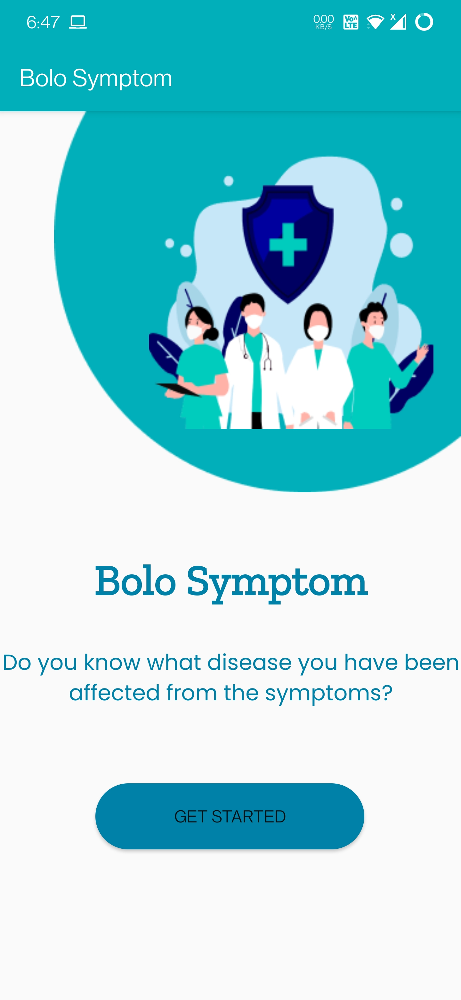
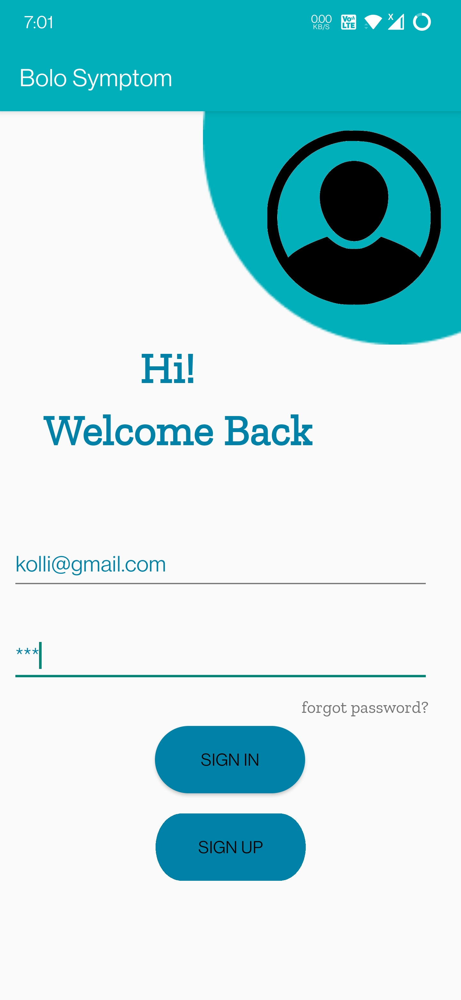
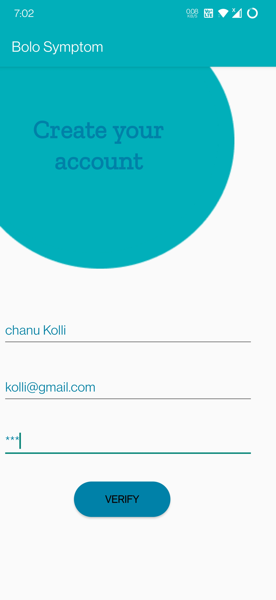
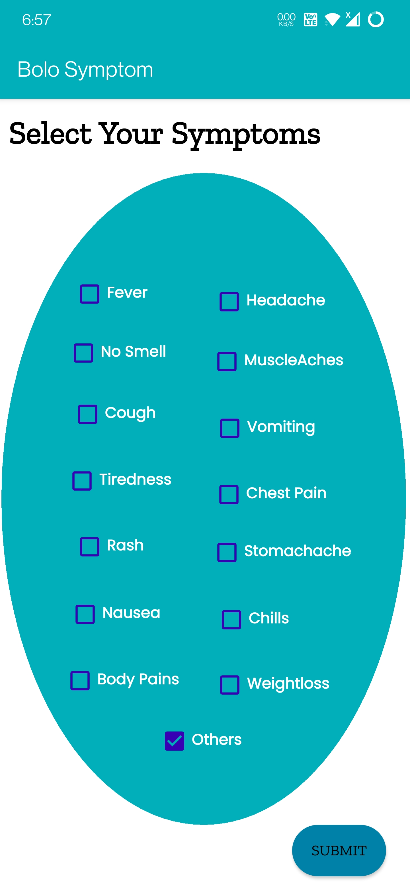
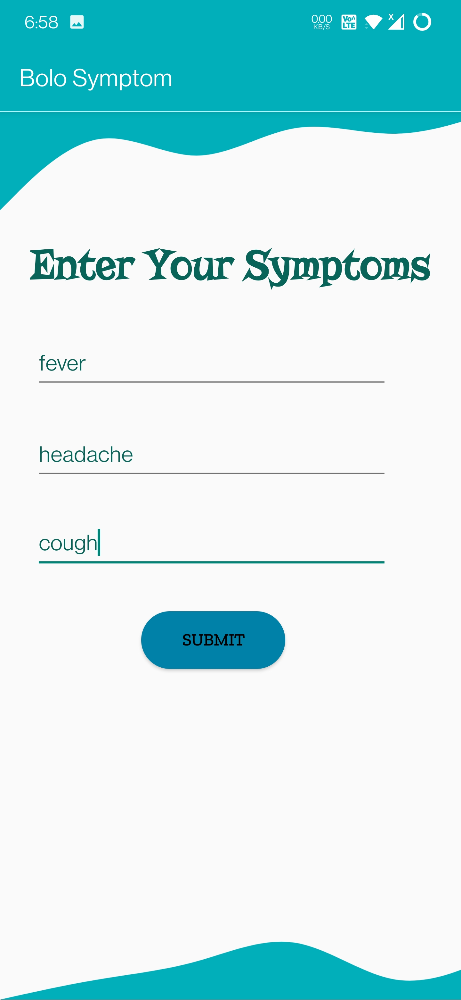
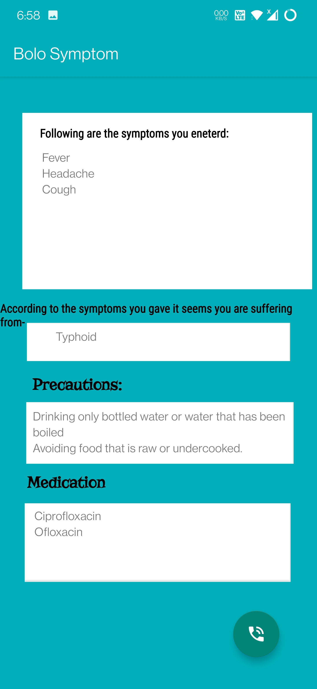

# BoloSymptom
>Java application which provides medical prescription.

## Table of Contents
* [App Description](#app-description)
* [Purpose](#purpose)
* [Technologies Used](#technologies-used)
* [Features](#features)
* [Screenshots](#screenshots)
* [Room for Improvement](#room-for-improvement)
* [Team Members](#team_members)

## App Description
- The name of the app that we developed is "Bolo symptom". 
- This app mainly focusses on the symptoms, as it takes symptoms as a input from the user and according to that the disease name will be displayed to the end-user as output.
- According to the diseases he got infected with, a medical prescription will be given.
- If the user wants to consult a medical professional to get to know more about the disease, we included "call option" to fulfill their need.

## Purpose
- The purpouse of this app is to make the user  well aware about the disease they got infected with, from the symotoms they have.
- With this they can know about the disease when it is in it's primary stage and can take necessary prescription provided to eradicate it. 

## Technologies Used
- Java
- Sql lite(for database connection)

## Features
- Registration page
- Login page
- User input page
- Report card page
- Call

## Screenshots

## Room for Improvement
- Chatbot for making an appointment to consult a doctor 
- including more test cases for diseses to make the app more accurate.

## Team Members
- K.Chanakya Raghavendra (19BCN7141)
- B.Vignesh(19BCE7085)
- N.Dhanunjay(19BCN7025)
- P.V.Sai Pavan Kalyan(19BCE7414)
